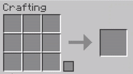

# ReDyeable

<!-- | [![][modrinth-badge]][modrinth-link] | [![][curseforge-badge]][curseforge-link] | [![][discord-badge]][discord-link] |
| ------------------------------------ | ---------------------------------------- | ---------------------------------- | -->

| [![][modrinth-badge]][modrinth-link] |
| ------------------------------------ |

## Welcome to ReDyeable!

> ![INFO]
> This mod / data pack is a remake of the original [ReDyeable](https://www.curseforge.com/minecraft/mc-mods/redyeable) mod by willowmayweep

ReDyeable is a basic mod that allows the player to redye blocks like glass and terracotta as many times as they want and individually, like wool.

**WIth Redyeable:**

**Without Redyeable:**

Normally, you can only dye blocks like terracotta and glass once and in strict groups of eight. Redyeable lets the player dye these blocks multiple times and one at a time—just like wool. Redyeable also adds this functionality to banners, candles, concrete, concrete powder, glass panes, and glazed terracotta. Redyeable will work just fine in singleplayer, but must be installed on the server to work in multiplayer.

[modrinth-badge]: https://img.shields.io/modrinth/dt/{modrinth-project-id}?style=for-the-badge&logo=modrinth&labelColor=16181c&color=00ad5b
[modrinth-link]: https://modrinth.com/project/rLCrXpGS
<!-- [curseforge-badge]: https://img.shields.io/curseforge/dt/{curseforge-project-id}?style=for-the-badge&logo=curseforge&label=CurseForge%20Downloads&labelColor=0d0d0d&color=ff784d
[curseforge-link]: https://www.curseforge.com/projects/... -->
<!-- [discord-badge]: https://img.shields.io/discord/{discord-id}?style=for-the-badge&logo=discord&label=discord&labelColor=2b2d31&color=23a55a
[discord-link]: https://discord.com/invite/... -->
